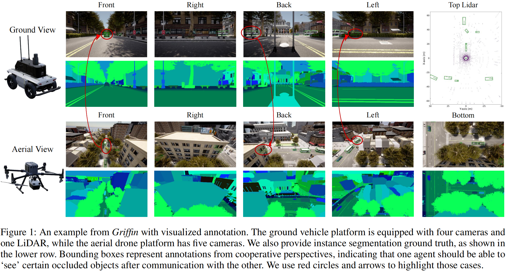
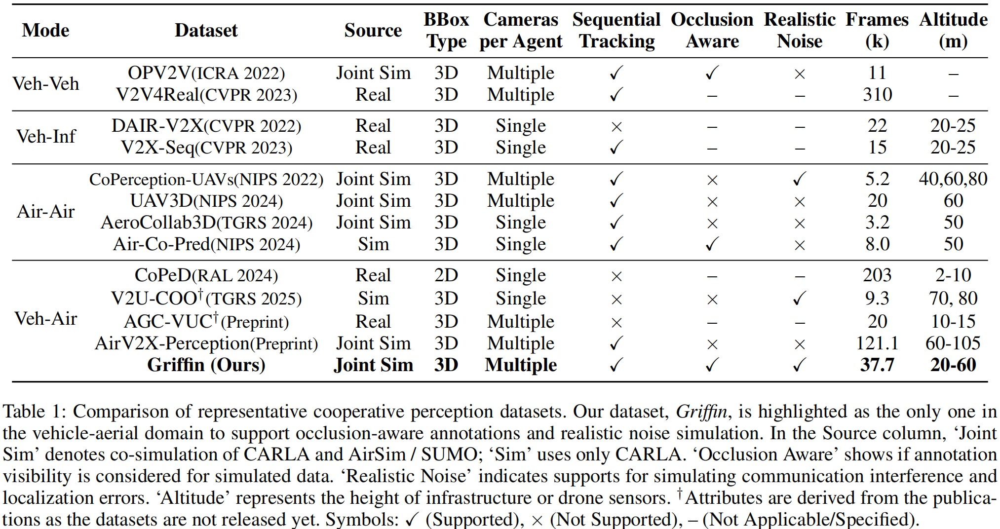
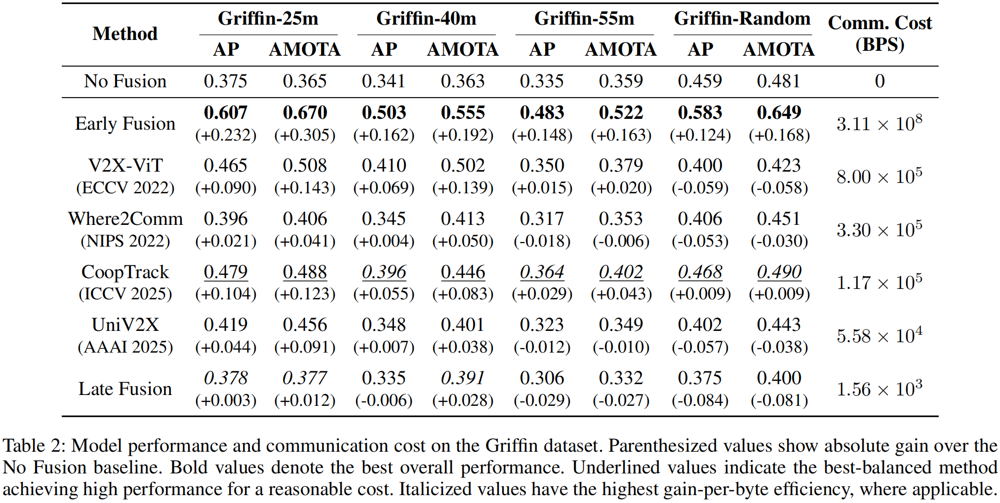
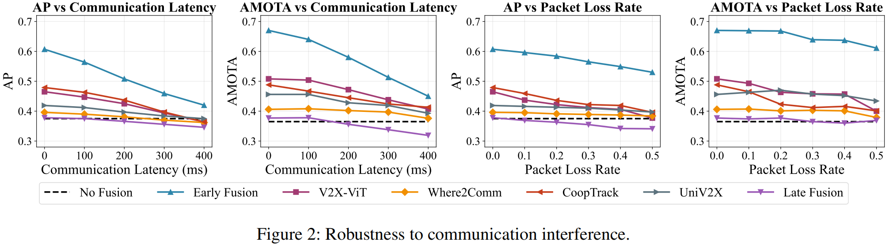
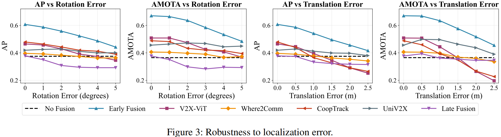

<div align="center">

# 🦅 Griffin

**A Pioneering Large-scale Dataset and Benchmark for Aerial-Ground Cooperative 3D Perception**

[](https://arxiv.org/abs/2503.06983)
[](https://pan.baidu.com/s/1NDgsuHB-QPRiROV73NRU5g?pwd=u3cm)
[](https://huggingface.co/datasets/wjh-svm/Griffin)
[](https://github.com/wang-jh18-SVM/Griffin)
[](LICENSE)

</div>

---

## 🎯 What is Griffin?

<div align="center">

</div>

**Griffin** is a pioneering publicly large-scale dataset specifically designed for aerial-ground cooperative 3D perception. Our dataset pushes the boundaries of multi-agent perception by combining aerial and ground-based viewpoints for enhanced 3D object detection and tracking.

### ✨ Key Features

- 🎬 **250+ Dynamic Scenes** with realistic traffic patterns
- 📸 **37K Frames** and **340K High-quality Images**
- 🎯 **Instance-aware Occlusion Analysis** for precise labels
- ✈️ **Multi-altitude Drone Simulation** (20m-60m)
- 🌍 **CARLA-AirSim Co-simulation** for photorealistic environments
- 🎪 **Comprehensive Benchmarks** for detection and tracking
- 📡 **Robustness Evaluation** under communication interference and localization errors

<div align="center">

</div>

## 📋 Table of Contents

- [🦅 Griffin](#-griffin)
  - [🎯 What is Griffin?](#-what-is-griffin)
    - [✨ Key Features](#-key-features)
  - [📋 Table of Contents](#-table-of-contents)
  - [🔥 Latest News](#-latest-news)
  - [📚 Documentation](#-documentation)
  - [📈 Main Results](#-main-results)
    - [🎯 Baseline Performance](#-baseline-performance)
    - [🌐 Communication Robustness](#-communication-robustness)
    - [📍 Localization Robustness](#-localization-robustness)
    - [🏆 Key Insights](#-key-insights)
  - [📝 Citation](#-citation)
  - [🙏 Acknowledgements](#-acknowledgements)

---

## 🔥 Latest News

> 🚨 **Stay updated with the latest developments in Griffin!**

| Date       | Update                      | Description                                                                                                                                                                          |
| ---------- | --------------------------- | ------------------------------------------------------------------------------------------------------------------------------------------------------------------------------------ |
| **2025/8** | 🔧 **Robustness Evaluation** | Testing configurations for localization errors, communication latency, and packet loss are now available                                                                             |
| **2025/7** | 📊 **Griffin-55m Subset**    | New subset Griffin-55m and corresponding model checkpoints are released                                                                                                              |
| **2025/3** | 🤖 **UniV2X Models**         | Released reimplementation code and pre-trained models for UniV2X                                                                                                                     |
| **2025/3** | 💾 **Dataset V1.0**          | Griffin V1.0 dataset is available on [Baidu Netdisk](https://pan.baidu.com/s/1NDgsuHB-QPRiROV73NRU5g?pwd=u3cm) and [🤗 Hugging Face](https://huggingface.co/datasets/wjh-svm/Griffin) |
| **2025/3** | 📄 **Paper Published**       | Our paper is now available on [ArXiv](https://arxiv.org/abs/2503.06983)                                                                                                              |

---

## 📚 Documentation

Comprehensive guides to help you get the most out of Griffin:

| Guide                       | Description                             | Link                                                               |
| --------------------------- | --------------------------------------- | ------------------------------------------------------------------ |
| 🛠️ **Installation**          | Step-by-step setup instructions         | [docs/Installation.md](docs/Installation.md)                       |
| 📊 **Dataset Preparation**   | How to download and organize the data   | [docs/Dataset_Preparation.md](docs/Dataset_Preparation.md)         |
| 🏃‍♂️ **Training & Evaluation** | Run experiments and evaluate models     | [docs/Training_and_Evaluation.md](docs/Training_and_Evaluation.md) |
| 🎨 **Visualization**         | Visualize results and debug your models | [docs/Visualization.md](docs/Visualization.md)                     |

---

## 📈 Main Results

Griffin provides comprehensive benchmarks across multiple models and challenging scenarios. Our evaluation covers detection and multi-object tracking metrics under various conditions.

### 🎯 Baseline Performance

The AP and AMOTA metrics of every baseline among different subsets are shown below. For detailed results with all metrics, see [📊 detailed_results.csv](docs/detailed_results.csv).

<div align="center">

</div>

### 🌐 Communication Robustness

<div align="center">

</div>

### 📍 Localization Robustness  

<div align="center">

</div>

### 🏆 Key Insights

- **🤝 Cooperative Potential**: In favorable conditions, cooperative methods achieve substantial performance gains over single-agent baselines by resolving occlusions and expanding the effective field-of-view
- **✈️ Altitude Sensitivity**: Strong sensitivity to drone flight altitude affects performance, with instance-level fusion strategies proving more resilient to perspective shifts than dense BEV-level approaches
- **🎯 Adaptive Filtering**: Resilience to localization errors is directly linked to adaptive data filtering—methods with selective fusion (instance-level filtering or spatial confidence maps) demonstrate superior robustness
- **🔮 Future Directions**: Research should focus on altitude-adaptive fusion mechanisms, sparse communication-efficient methods, and dynamic trust mechanisms for reliable real-world deployment

---

## 📝 Citation

If you find Griffin useful for your research, please consider giving us a ⭐ and citing our work:

```bibtex
@misc{wang2025griffinaerialgroundcooperativedetection,
      title={Griffin: Aerial-Ground Cooperative Detection and Tracking Dataset and Benchmark},
      author={Jiahao Wang and Xiangyu Cao and Jiaru Zhong and Yuner Zhang and Haibao Yu and Lei He and Shaobing Xu},
      year={2025},
      eprint={2503.06983},
      archivePrefix={arXiv},
      primaryClass={cs.CV},
      url={https://arxiv.org/abs/2503.06983},
}
```

---

## 🙏 Acknowledgements

We extend our heartfelt gratitude to the amazing open-source community and these outstanding projects that made Griffin possible:

<div align="center">

| Project             | Contribution                                         | Link                                                     |
| ------------------- | ---------------------------------------------------- | -------------------------------------------------------- |
| 🔧 **MMDetection3D** | Core 3D detection framework and infrastructure       | [GitHub](https://github.com/open-mmlab/mmdetection3d)    |
| 🤝 **UniV2X**        | Cooperative perception methodologies and inspiration | [GitHub](https://github.com/AIR-THU/UniV2X)              |
| 🚗 **BEVFormer**     | Bird's-eye-view 3D object detection baseline         | [GitHub](https://github.com/fundamentalvision/BEVFormer) |
| 🎯 **AB3DMOT**       | 3D multi-object tracking algorithms and evaluation   | [GitHub](https://github.com/xinshuoweng/AB3DMOT)         |

</div>

---

<div align="center">

**Star ⭐ this repository if you found it helpful!**

<p>


</p>

*Made with ❤️ by the Griffin team*

</div>
