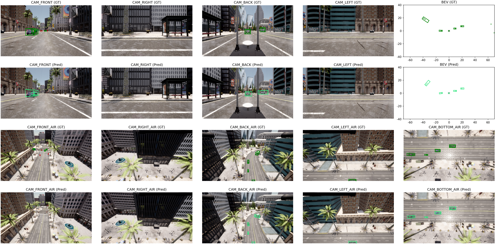

# 👁️ Visualization Guide

Griffin provides powerful visualization tools to help you understand the dataset, validate your models, and create compelling demonstrations of aerial-ground cooperative perception.

## 🎯 Visualization Overview

Griffin supports multiple visualization modes for different use cases:

| Mode                 | Data Source    | Purpose              | Output             |
| -------------------- | -------------- | -------------------- | ------------------ |
| **📊 KITTI-Style**    | Raw data       | Dataset exploration  | Static images      |
| **🎬 NuScenes-Style** | Processed data | Fusion visualization | Synchronized views |

---

## 📊 KITTI-Style Visualization (Ground Truth Only)

Perfect for exploring the raw dataset and understanding data structure.

### 🚗 Vehicle-Side Data

Visualize ground vehicle perspective:

```bash
python tools/griffin_data_converter/visual_kitti.py datasets/griffin_50scenes_25m/griffin-release/vehicle-side/
```

### 🚁 Drone-Side Data

Visualize aerial perspective:

```bash
python tools/griffin_data_converter/visual_kitti.py datasets/griffin_50scenes_25m/griffin-release/drone-side/
```

---

## 🎬 NuScenes-Style Visualization (Predictions + Ground Truth)

Advanced visualization for model evaluation and cooperative perception analysis.

### Basic Cooperative Visualization

Visualize both ground truth and model predictions:

```bash
python tools/analysis_tools/visual_griffin.py \
    --dataroot datasets/griffin_50scenes_25m/griffin-nuscenes/early-fusion \
    --out_folder result_vis/griffin_25m_early_fusion \
    --predroot YOUR_PATH
    
# The predroot should be similar with: projects/work_dirs_griffin_50scenes_25m/early-fusion/tiny_track_r50_stream_bs8_48epoch_3cls/json_output/Fri_Aug__1_06_24_45_2025/results_nusc.json
```


---

## 📊 Sample Visualizations

Check out our visualization examples:

**🎬 Demo Video**: 
[](./video/Griffin_r1200_10fps_1_3Mbps.mp4)